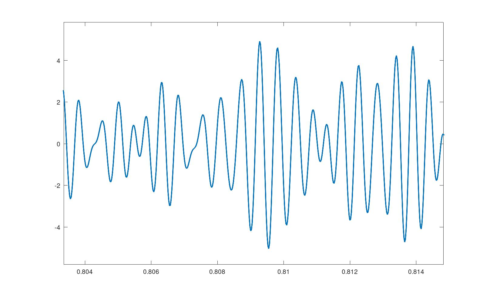

# Set of GNU Octave projects

This is a collection of GNU Octave projects that can be used individualy or as an 
inspiration for more strong-mantained projects.

## Contents

- Acoustics
- Signal processing

## How to get involved?

If you want improve this repository, you can do it with new ideas, giving feedback, forking 
individual projects into a more detailed and strong-mantained one...

## Samples

The following picture is the graphic representation of **randtones** function 
which is implemented on [randtones.m](./inst/randtones.m) file

